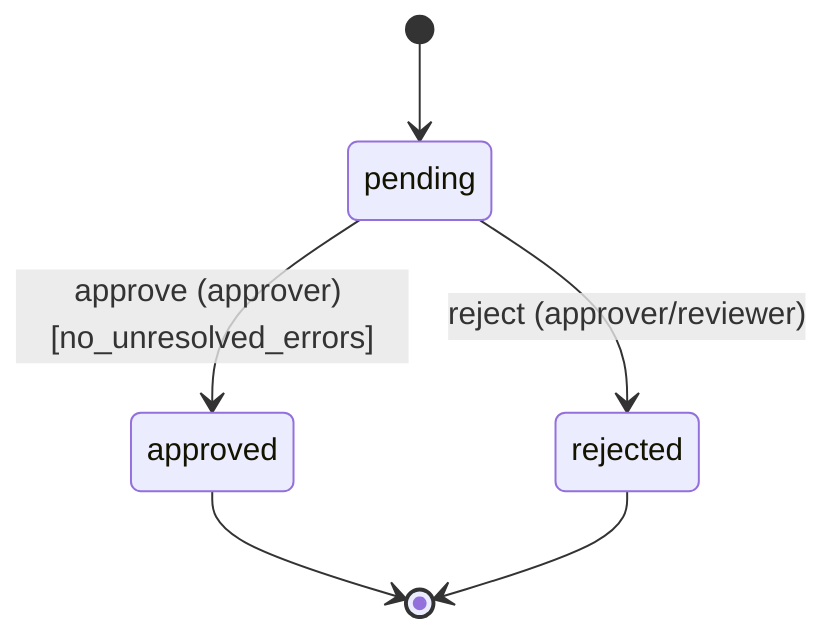

# Batch review lifecycle

> **Generated file — do not edit by hand.** Regenerate with `make spec-doc`. The source of truth is the spec in `app/statespec/batch_spec.py`; this document is rendered from it so the picture can never drift from the enforced behaviour.

## Lifecycle

## States

| State | Meaning |
| --- | --- |
| `pending` _(start)_ | Uploaded and awaiting review. |
| `approved` _(final)_ | Cleared for downstream processing. |
| `rejected` _(final)_ | Declined — will not be processed. |

## Transitions

| Action | From | To | Who may do it | Condition |
| --- | --- | --- | --- | --- |
| **approve** — Approve the batch (only when every validation error is resolved). | pending | approved | approver | no_unresolved_errors |
| **reject** — Reject the batch (final). | pending | rejected | approver, reviewer | — |

## Guarantees that always hold

These invariants are checked after *every* transition by the property-based test suite (Hypothesis), across randomly generated sequences of actions:

- **status_declared** — The status is always one of the declared states.
- **approved_implies_clean** — An approved batch has no unresolved validation errors.
