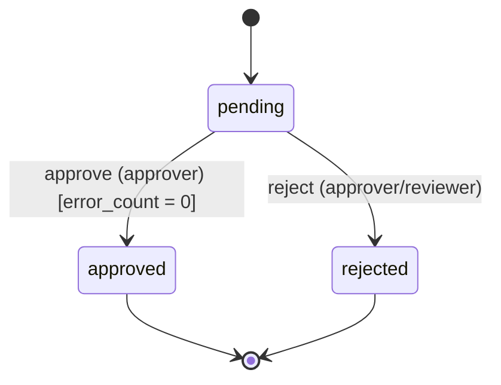

# Batch review lifecycle

> **Generated file — do not edit by hand.** Regenerate with `make spec-doc`. The source of truth is the spec in `app/statespec/batch_spec.py`; this document is rendered from it so the picture can never drift from the enforced behaviour.

## Lifecycle

## States

| State | Meaning |
| --- | --- |
| `pending` _(start)_ | Uploaded and awaiting review. |
| `approved` _(final)_ | Cleared for downstream processing. |
| `rejected` _(final)_ | Declined — will not be processed. |

## Transitions

| Action | From | To | Who may do it | Condition |
| --- | --- | --- | --- | --- |
| **approve** — Approve the batch (only when every validation error is resolved). | pending | approved | approver | error_count = 0 |
| **reject** — Reject the batch (final). | pending | rejected | approver, reviewer | — |

## Invariants

Properties that must hold in every reachable state. The engine evaluates them against the proposed post-state on every transition and refuses the transition if any fails; the property-based suite (Hypothesis) also checks them across random action sequences. (A mutation made entirely outside a transition is still beyond the engine's reach — that is the database-constraint domain.)

- **status_declared** (`status ∈ {"pending", "approved", "rejected"}`) — The status is always one of the declared states.
- **approved_implies_clean** (`(status ≠ "approved" or error_count = 0)`) — An approved batch has no unresolved validation errors.
